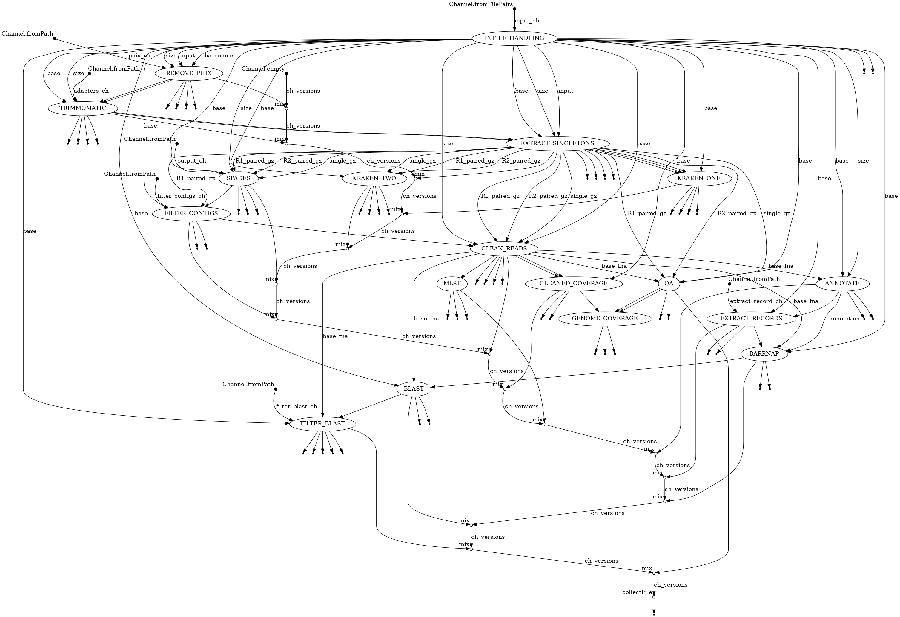

# Assembly Paired End Illumina Workflow

<br>



*A schematic of the steps in the workflow.*

<br>

## Requirements
* Nextflow
* Docker or Singularity

<br>

## Install
```
git clone https://github.com/gregorysprenger/wf-paired-end-illumina-assembly.git
```

<br>

# Run Workflow
Example data are included in assets/test_data directory.

```
nextflow run \
-profile singularity main.nf \
--inpath assets/test_data \
--outpath results
```

Test data was generated by taking top 1 million lines of SRA data SRR16343585. (Note: This requires SRAtoolkit)
```
fasterq-dump SRR16343585
head -1000000 SRR16343585_1.fastq > test_R1.fastq
head -1000000 SRR16343585_2.fastq > test_R2.fastq
gzip test_R*.fastq
```

<br>

## For Aspen Cluster - Set up Singularity PATH
```
# Add to $HOME/.bashrc
SINGULARITY_BASE=/scicomp/scratch/$USER
export SINGULARITY_TMPDIR=$SINGULARITY_BASE/singularity.tmp
export SINGULARITY_CACHEDIR=$SINGULARITY_BASE/singularity.cache
export NXF_SINGULARITY_CACHEDIR=$SINGULARITY_BASE/singularity.cache
mkdir -pv $SINGULARITY_TMPDIR $SINGULARITY_CACHEDIR
```
Reload .bashrc
```
source ~/.bashrc
```

Load nextflow
```
module load nextflow
```

<br>
<br>

# Steps in the workflow
1. Identifies paired FastQ files in a given path
    -   Recognized extensions are: fastq.gz, fq.gz
2. Remove PhiX from reads using bbduk
    -   Output \<trim_reads>: 
        - Total reads <\*_raw.tsv>
        - PhiX reads - <\*_phix.tsv>
3. Adapter clipping and quality trimming using trimmomatic
    -   Output \<trim_reads>: 
        - Discarded reads and Singletons <\*_trimmo.tsv>
4. Merge verlapping sister reads into singleton reads using flash
    -   Output \<trim_reads>: 
        - Paired and single reads: <\*{R1,R2}.paired.fq.gz>, <\*single.fq.gz>
        - Number of overlapping reads <\*overlap.tsv>
        - Number of cleaned reads: <\*clean-reads.tsv>
5. Binning of paired reads with kraken 1 and 2
    - Output \<trim_reads>: 
        - Summary output <taxonomy{1,2}-reads.tab>
        - Full kraken output <kraken{1,2}.tab.gz>
6. Assemble contigs with SPAdes
    - Output \<asm>: 
        - All output <spades/>
        - Contigs <spades/contigs.fasta>
7. Filter contigs based on length, coverage, GC skew, and compositional complexity
8. Correct contigs with paired end reads using bwa, samtools, and pilon
    - Output \<asm>: 
        - Corrected spades assembly <\*.fna>
        - Number of indels <\*.InDels-corrected.cnt.txt>
        - Number of SNPs <\*.SNPs-corrected.cnt.txt>
9. Calculate coverage of reads using bedtools
    - Output \<qa>: 
        - Reads mapped <Summary.Illumina.CleanedReads-AlnStats.tab>
10. Identify MLST for each assembly
    - Output \<qa>: 
        - MLST result <Summary.MLST.tab>
11. Annotate reads using prokka
    - Output \<annot>: 
        - Genbank annotation <\*.gbk>
12. Identify ribosomal RNA genes to blast
    - Output \<ssu>:
        - Blast results <\*.blast.tsv.gz>
        - Top species identified <*-species.tsv>
    - Output: \<qa>: 
        - Top blast results summary <Summary.16S.tab>
13. Assess the qualtiy of the assembly
    - Output \<qa>:
        - Contig summary <Summary.Assemblies.tab>
        - Number of bases cleaned <Summary.Illumina.CleanedReads-Bases.tab>
14. Calculate the genome coverage
    - Output \<qa>:
        - Genome coverage <Summary.Illumina.GenomeCoverage.tab>

<br>