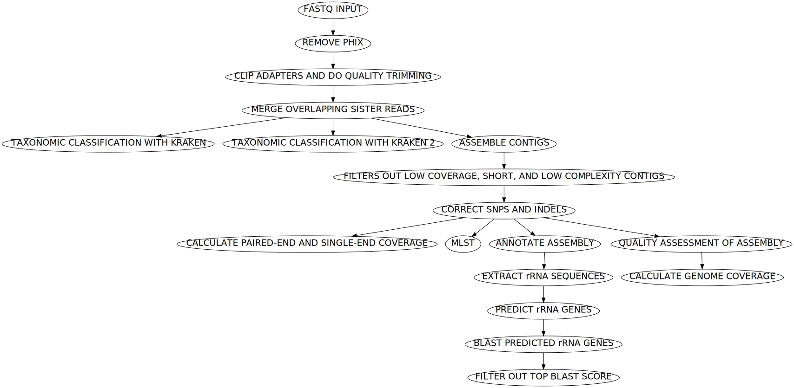
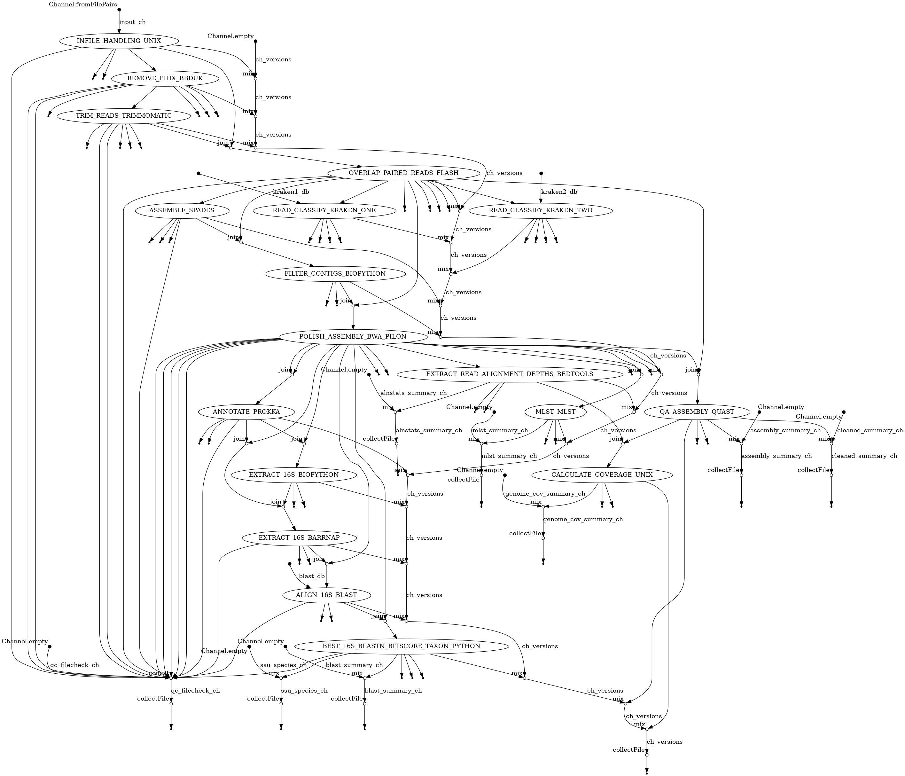

# Assembly Paired End Illumina Workflow




*General schematic of the steps in the workflow*

## Quick Start: Test

Run the built-in test set to confirm all parts are working as-expected. It will also download all dependencies to make subsequent runs much faster.
```
nextflow run \
 wf-paired-end-illumina-assembly \
 -r v1.1.0 \
 -profile YOURPROFILE,test
```
## Quick Start: Run

Example command on FastQs in "new-fastq-dir" data with singularity:
```
nextflow run \
 wf-paired-end-illumina-assembly/ \
 -r v1.1.0 \
 -profile singularity
 --inpath new-fastq-dir \
 --outpath my-results
```

## Contents
- [Introduction](#Introduction)
- [Installation](#Installation)
- [Output File Structure](#Output-File-Structure)
- [Parameters](#parameters)
- [Quick Start](#Quick-Start-Test)
- [Resource Managers](#Resource-Managers)
- [Troubleshooting](#Troubleshooting)
- [Usage](#usage)
- [Workflow](#Workflow)

## Introduction
This workflow assembles bacterial isolate genomes from paired-end Illumina FastQ files. Post-assembly contig correction is performed, and a variety of quality assessment processes are recorded throughout the workflow.

This procedure can be used for all bacterial isolates (i.e., axenic, non-mixed cultures) sequenced with whole genome (WGS) or selective whole genome (SWGA) library preparation strategies. It is inappropriate for metagenomics analysis. The data files must be paired read sets (not single ended) and can come from any Illumina sequencing instrument which generates a FastQ file format (e.g., iSeq, HiSeq, MiSeq, NextSeq, NovaSeq). The read set files can be obtained from an external source, local storage device, or sequencing instrument. Other sequencing manufacturers such as Ion Torrent, PacBio, Roche 454, and Nanopore generate data files that cannot be directly used with this procedure.

## Installation
- [Nextflow](https://www.nextflow.io/docs/latest/getstarted.html#installation) `>=21.10.3`
- [Docker](https://docs.docker.com/engine/installation/) or [Singularity](https://www.sylabs.io/guides/3.0/user-guide/) `>=3.8.0`
- [Conda](https://docs.conda.io/projects/conda/en/latest/user-guide/install/index.html) is currently unsupported

## Usage
```
nextflow run wf-paired-end-illumina-assembly -profile <docker|singularity> --inpath <input directory> --outpath <directory for results>
```

## Parameters
Note the "`--`" long name arguments (e.g., `--help`, `--inpath`, `--outpath`) are generally specific to this workflow's options, whereas "`-`" long name options (e.g., `-help`, `-latest`, `-profile`) are general nextflow options.

These are the most pertinent options for this workflow:
```
  --inpath             Path to input data directory containing FastQ assemblies. Recognized extensions are:  fastq.gz, fq.gz.

  --outpath            The output directory where the results will be saved.

  --kraken1_db         Specify path to database for Kraken1. Default database is Mini Kraken.

  --kraken2_db         Specify path to database for Kraken2. Default database is Mini Kraken.

  --blast_db           Specify path to 16S ribosomal database for BLAST. Default database is NCBI's 16S ribosomal database.

  -profile singularity Use Singularity images to run the workflow. Will pull and convert Docker images from Dockerhub if not locally available.

  -profile docker      Use Docker images to run the workflow. Will pull images from Dockerhub if not locally available.

```

View help menu of all workflow options:
```
nextflow run \
 wf-paired-end-illumina-assembly \
 -r v1.1.0 \
 --help
```

## Resource Managers
The most well-tested and supported is a Univa Grid Engine (UGE) job scheduler with Singularity for dependency handling.

1. UGE/SGE 
    - Additional tips for UGE processing are [here](docs/HPC-UGE-scheduler.md).
1. no scheduler

    - It has also been confirmed to work on desktop and laptop environments without a job scheduler using Docker with more tips [here](docs/local-device.md).


## Output File Structure
| Output Directory | Filename | Explanation |
| ---------------- | ---------------- | ---------------- |
| **annot** | | **Annotation files** |
| | \<SampleName\>.gbk | Genbank annotation |
| **asm** | | **Assembly files** |
| | \<SampleName\>.fna | Corrected assembly |
| | \<SampleName\>.InDels-corrected.cnt.txt | Each line represents number of corrected InDels (per correction round) |
| | \<SampleName\>.SNPs-corrected.cnt.txt | Each line represents number of corrected SNPs (per correction round) |
| **asm/\<SampleName\>** | | **SPAdes Assembly files** |
| | assembly_graph_with_scaffolds.gfa | Contains SPAdes assembly graph and scaffolds paths |
| | contigs.fasta | Assembled contigs from SPAdes |
| | params.txt.gz | Parameters used with SPAdes |
| | spades.log.gz | Log information from SPAdes |
| **qa** | | **Quality Assurance files** |
| | Summary.Illumina.CleanedReads-AlnStats.tab | Basepairs of Paired Reads and Singnleton Reads mapped |
| | Summary.MLST.tab | MLST result |
| | Summary.16S.tab | Top BLAST hit results |
| | Summary.Assemblies.tab | Contig summary information |
| | Summary.Illumina.GenomeCoverage.tab | Genome Coverage |
| | Summary.QC_File_Checks.tab | QC file checks |
| **ssu** | | **Small Subunit (16S) files** |
| | \<SampleName\>.blast.tsv.gz | BLAST output |
| | 16S-top-species.tsv | Top BlAST hit results |
| | 16S.\<SampleName\>.fa | Top BLAST hit in FastA format |
| **trim_reads** | | **Trimmed Reads** |
| | \<SampleName\>.raw.tsv | Total reads |
| | \<SampleName\>.phix.tsv | PhiX reads |
| | \<SampleName\>.trimmo.tsv | Discarded reads and singletons |
| | \<SampleName\>_{R1,R2}.paired.fq.gz | Cleaned paired reads |
| | \<SampleName\>.single.fq.gz | Cleaned single read |
| | \<SampleName\>.overlap.tsv | Number of overlapping reads |
| | \<SampleName\>.clean-reads.tsv | Number of cleaned reads |
| | \<SampleName\>.taxonomy1-reads.tab | Summary output of Kraken 1 |
| | \<SampleName\>.taxonomy2-reads.tab | Summary output of Kraken 2 |
| | \<SampleName\>_kraken1.tab.gz | Full output of Kraken 1 |
| | \<SampleName\>_kraken2.tab.gz | Full output of Kraken 2 |
| **log** | | **Log files** |
| | ASM_\<Number of Samples\>.o\<Submission Number\> | HPC output report |
| | ASM_\<Number of Samples\>.e\<Submission Number\> | HPC error report |
| | pipeline_dag.\<YYYY-MM-DD_HH-MM-SS\>.html | Direct acrylic graph of workflow |
| | report.\<YYYY-MM-DD_HH-MM-SS\>.html | Nextflow summary report of workflow |
| | timeline.\<YYYY-MM-DD_HH-MM-SS\>.html | Nextflow execution timeline of each process in workflow |
| | trace.\<YYYY-MM-DD_HH-MM-SS\>.txt | Nextflow execution tracing of workflow, which includes percent of CPU and memory usage |
| | software_versions.yml | Versions of software used in each process |
| | errors.tsv | Errors file if errors exist and summarizes the errors |
| **log/process_logs** | | **Process log files** |
| | \<SampleName\>.\<ProcessName\>.command.out | Standard output for \<SampleName\> during process \<ProcessName\> |
| | \<SampleName\>.\<ProcessName\>.command.err | Standard error for \<SampleName\> during process \<ProcessName\> |
| **log/qc_file_checks** | | QC file check log files |
| | \<SampleName\>.Raw_Initial_FastQ_Files.tsv | Raw Initial FastQ File Check |
| | \<SampleName\>.PhiX_Genome.tsv | PhiX Genome Check |
| | \<SampleName\>.PhiX-removed_FastQ_Files.tsv | PhiX-removed FastQ File Check |
| | \<SampleName\>.Adapters_FastA.tsv | Adapters FastA File Check |
| | \<SampleName\>.Adapter-removed_FastQ_Files.tsv | Adapter-removed FastQ File Check |
| | \<SampleName\>.Non-overlapping_FastQ_Files.tsv | Non-overlapping FastQ File Check |
| | \<SampleName\>.Raw_Assembly_File.tsv | Raw Assembly File Check |
| | \<SampleName\>.Filtered_Assembly_File.tsv | Filtered Assembly File Check |
| | \<SampleName\>.Binary_PE_Alignment_Map_File.tsv | Binary Paired-End Alignment Map File Check |
| | \<SampleName\>.Polished_Assembly_File.tsv | Polished Assembly File Check |
| | \<SampleName\>.Final_Corrected_Assembly_FastA_File.tsv | Final Corrected Assembly FastA File Check |
| | \<SampleName\>.Binary_SE_Alignment_Map_File.tsv | Binary Singletons Alignment Map File Check |
| | \<SampleName\>.Annotated_GenBank_File.tsv | Annotated GenBank File Check |
| | \<SampleName\>.SSU_Extracted_File.tsv | SSU Extracted File Check |
| | \<SampleName\>.16S_BLASTn_Output_File.tsv | 16S BLASTn Output File Check |
| | \<SampleName\>.Filtered_16S_BLASTn_File.tsv | Filtered 16S BLASTn File Check |

## Workflow
The complete directed acyclic graph (DAG) this workflow performs is this:


## Troubleshooting
Q: It failed, how do I find out what went wrong?

A: View file contents in the `<outpath>/log` directory.