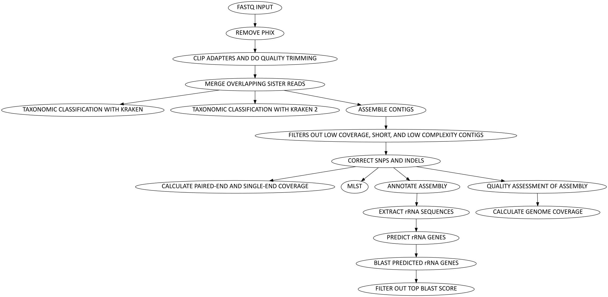

# Assembly Paired End Illumina Workflow




*A schematic of the steps in the workflow.*


## Requirements
* [`Nextflow`](https://www.nextflow.io/docs/latest/getstarted.html#installation) (`>=21.10.3`)
* [`Docker`](https://docs.docker.com/engine/installation/) or [`Singularity >=3.8.0`](https://www.sylabs.io/guides/3.0/user-guide/)


## Install on our HPC
```
git clone https://github.com/gregorysprenger/wf-paired-end-illumina-assembly.git $LAB_HOME/workflows
```

## Setup Singularity environment variables - For Aspen Cluster
```
# Add to $HOME/.bashrc
SINGULARITY_BASE=/scicomp/scratch/$USER

export SINGULARITY_TMPDIR=$SINGULARITY_BASE/singularity.tmp

export SINGULARITY_CACHEDIR=$SINGULARITY_BASE/singularity.cache

export NXF_SINGULARITY_CACHEDIR=$SINGULARITY_BASE/singularity.cache

mkdir -pv $SINGULARITY_TMPDIR $SINGULARITY_CACHEDIR
```

Reload .bashrc
```
source ~/.bashrc
```

# Run Workflow
Before running workflow on new data, the workflow should be ran on the built-in test data to make sure everything is working properly. It will also download all dependencies to make subsequent runs much faster.

```
cd $LAB_HOME/workflows/wf-paired-end-illumina-assembly
ml nextflow
nextflow run main.nf \
 -profile singularity,test
```

To minimize typing all of the parameters above, a bash script was created for UGE HPCs. It can take PE FastQ files from selected directory OR if FastQ files not found in that directory, it will look in subdirectories for FastQ files. To run:

```
run_assembly.uge-nextflow <INPUT_DIR>
```


Example data are included in assets/test_data directory.

```
nextflow run main.nf \
 -profile singularity \
 --inpath assets/test_data \
 --outpath results
```

Help menu of all options:

```
nextflow run main.nf --help
```

Test data was generated by taking top 1 million lines (=250k reads) of SRA data SRR16343585. (Note: This requires SRAtoolkit)

```
fasterq-dump SRR16343585
head -1000000 SRR16343585_1.fastq > test_R1.fastq
head -1000000 SRR16343585_2.fastq > test_R2.fastq
pigz test_R{1,2}.fastq
```

# Output File Structure
| Output Directory | Filename | Explanation |
| ---------------- | ---------------- | ---------------- |
| **annot** | | **Annotation files** |
| | \<SampleName\>.gbk | Genbank annotation |
| **asm** | | **Assembly files** |
| | \<SampleName\>.fna | Corrected assembly |
| | \<SampleName\>.InDels-corrected.cnt.txt | Each line represents number of corrected InDels (per correction round) |
| | \<SampleName\>.SNPs-corrected.cnt.txt | Each line represents number of corrected SNPs (per correction round) |
| **asm/\<SampleName\>** | | **SPAdes Assembly files** |
| | assembly_graph_with_scaffolds.gfa | Contains SPAdes assembly graph and scaffolds paths |
| | contigs.fasta | Assembled contigs from SPAdes |
| | params.txt.gz | Parameters used with SPAdes |
| | spades.log.gz | Log information from SPAdes |
| **qa** | | **Quality Assurance files** |
| | Summary.Illumina.CleanedReads-AlnStats.tab | Basepairs of Paired Reads and Singnleton Reads mapped |
| | Summary.MLST.tab | MLST result |
| | Summary.16S.tab | Top BLAST hit results |
| | Summary.Assemblies.tab | Contig summary information |
| | Summary.Illumina.GenomeCoverage.tab | Genome Coverage |
| | Summary.QC_File_Checks.tab | QC file checks |
| **ssu** | | **Small Subunit (16S) files** |
| | \<SampleName\>.blast.tsv.gz | BLAST output |
| | 16S-top-species.tsv | Top BlAST hit results |
| | 16S.\<SampleName\>.fa | Top BLAST hit in FastA format |
| **trim_reads** | | **Trimmed Reads** |
| | \<SampleName\>.raw.tsv | Total reads |
| | \<SampleName\>.phix.tsv | PhiX reads |
| | \<SampleName\>.trimmo.tsv | Discarded reads and singletons |
| | \<SampleName\>_{R1,R2}.paired.fq.gz | Cleaned paired reads |
| | \<SampleName\>.single.fq.gz | Cleaned single read |
| | \<SampleName\>.overlap.tsv | Number of overlapping reads |
| | \<SampleName\>.clean-reads.tsv | Number of cleaned reads |
| | \<SampleName\>.taxonomy1-reads.tab | Summary output of Kraken 1 |
| | \<SampleName\>.taxonomy2-reads.tab | Summary output of Kraken 2 |
| | \<SampleName\>_kraken1.tab.gz | Full output of Kraken 1 |
| | \<SampleName\>_kraken2.tab.gz | Full output of Kraken 2 |
| **log** | | **Log files** |
| | ASM_\<Number of Samples\>.o\<Submission Number\> | HPC output report |
| | ASM_\<Number of Samples\>.e\<Submission Number\> | HPC error report |
| | pipeline_dag.\<YYYY-MM-DD_HH-MM-SS\>.html | Direct acrylic graph of workflow |
| | report.\<YYYY-MM-DD_HH-MM-SS\>.html | Nextflow summary report of workflow |
| | timeline.\<YYYY-MM-DD_HH-MM-SS\>.html | Nextflow execution timeline of each process in workflow |
| | trace.\<YYYY-MM-DD_HH-MM-SS\>.txt | Nextflow execution tracing of workflow, which includes percent of CPU and memory usage |
| | software_versions.yml | Versions of software used in each process |
| | errors.tsv | Errors file if errors exist and summarizes the errors |
| **log/process_logs** | | **Process log files** |
| | \<SampleName\>.\<ProcessName\>.command.out | Standard output for \<SampleName\> during process \<ProcessName\> |
| | \<SampleName\>.\<ProcessName\>.command.err | Standard error for \<SampleName\> during process \<ProcessName\> |
| **log/qc_file_checks** | | QC file check log files |
| | \<SampleName\>.Raw_Initial_FastQ_Files.tsv | Raw Initial FastQ File Check |
| | \<SampleName\>.PhiX_Genome.tsv | PhiX Genome Check |
| | \<SampleName\>.PhiX-removed_FastQ_Files.tsv | PhiX-removed FastQ File Check |
| | \<SampleName\>.Adapters_FastA.tsv | Adapters FastA File Check |
| | \<SampleName\>.Adapter-removed_FastQ_Files.tsv | Adapter-removed FastQ File Check |
| | \<SampleName\>.Non-overlapping_FastQ_Files.tsv | Non-overlapping FastQ File Check |
| | \<SampleName\>.Raw_Assembly_File.tsv | Raw Assembly File Check |
| | \<SampleName\>.Filtered_Assembly_File.tsv | Filtered Assembly File Check |
| | \<SampleName\>.Binary_PE_Alignment_Map_File.tsv | Binary Paired-End Alignment Map File Check |
| | \<SampleName\>.Polished_Assembly_File.tsv | Polished Assembly File Check |
| | \<SampleName\>.Final_Corrected_Assembly_FastA_File.tsv | Final Corrected Assembly FastA File Check |
| | \<SampleName\>.Binary_SE_Alignment_Map_File.tsv | Binary Singletons Alignment Map File Check |
| | \<SampleName\>.Annotated_GenBank_File.tsv | Annotated GenBank File Check |
| | \<SampleName\>.SSU_Extracted_File.tsv | SSU Extracted File Check |
| | \<SampleName\>.16S_BLASTn_Output_File.tsv | 16S BLASTn Output File Check |
| | \<SampleName\>.Filtered_16S_BLASTn_File.tsv | Filtered 16S BLASTn File Check |
