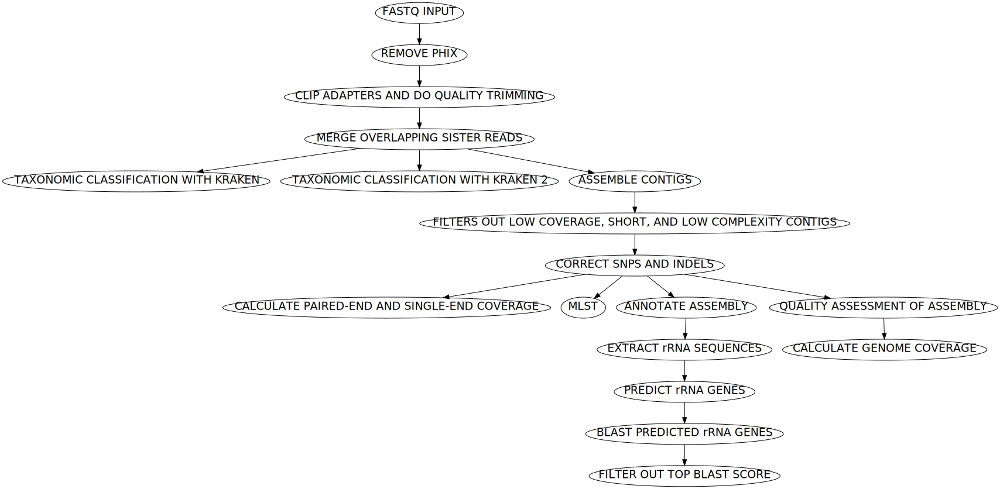

#  



*A schematic of the steps in the workflow.*


## Requirements
* [`Nextflow`](https://www.nextflow.io/docs/latest/getstarted.html#installation) (`>=22.04.3`)
* [`Docker`](https://docs.docker.com/engine/installation/) or [`Singularity >=3.8.0`](https://www.sylabs.io/guides/3.0/user-guide/)


## Install on our HPC
```
git clone https://github.com/gregorysprenger/wf-paired-end-illumina-assembly.git $LAB_HOME/workflows
```

## Setup Singularity environment variables - For Aspen Cluster
```
# Add to $HOME/.bashrc
SINGULARITY_BASE=/scicomp/scratch/$USER

export SINGULARITY_TMPDIR=$SINGULARITY_BASE/singularity.tmp

export SINGULARITY_CACHEDIR=$SINGULARITY_BASE/singularity.cache

export NXF_SINGULARITY_CACHEDIR=$SINGULARITY_BASE/singularity.cache

mkdir -pv $SINGULARITY_TMPDIR $SINGULARITY_CACHEDIR
```

Reload .bashrc
```
source ~/.bashrc
```

# Run Workflow
Before running workflow on new data, the workflow should be ran on the built-in test data to make sure everything is working properly. It will also download all dependencies to make subsequent runs much faster.

```
cd $LAB_HOME/workflows/wf-paired-end-illumina-assembly
ml nextflow
nextflow run main.nf \
 -profile singularity,test
```

To minimize typing all of the parameters above, a bash script was created for UGE HPCs. It can take PE FastQ files from selected directory OR if FastQ files not found in that directory, it will look in subdirectories for FastQ files. To run:

```
run_assembly.uge-nextflow <INPUT_DIR>
```


Example data are included in assets/test_data directory.

```
nextflow run main.nf \
 -profile singularity \
 --input assets/test_data \
 --outdir results
```

Help menu of all options:

```
nextflow run main.nf --help
```

Test data was generated by taking top 1 million lines (=250k reads) of SRA data SRR16343585. (Note: This requires SRAtoolkit)

```
fasterq-dump SRR16343585
head -1000000 SRR16343585_1.fastq > test_R1.fastq
head -1000000 SRR16343585_2.fastq > test_R2.fastq
pigz test_R{1,2}.fastq
```