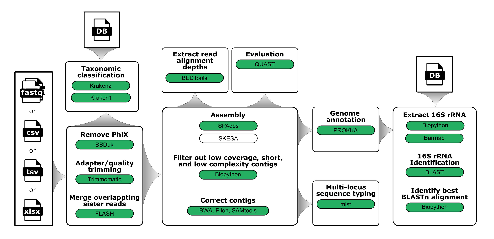

<h1>
  <picture>
    <source media="(prefers-color-scheme: dark)" srcset="images/wf-paired-end-illumina-assembly_logo_dark.png">
    
  </picture>
</h1>



> _General schematic of the steps in the workflow_

## Requirements

- [`Nextflow`](https://www.nextflow.io/docs/latest/getstarted.html#installation) (`>=22.04.3`)
- [`Docker`](https://docs.docker.com/engine/installation/) or [`Singularity`](https://www.sylabs.io/guides/3.0/user-guide/) (`>=3.8.0`)

# Quick Start: Test

Before running workflow on new data, the workflow should be run on the built-in test data to make sure everything is working properly. An internet connection is required for this. No `--input` is required, because it automatically fetches the test FastQ dataset. In addition to serving as a control, this will make subsequent runs _**much**_ faster.

```bash
nextflow run \
  bacterial-genomics/wf-paired-end-illumina-assembly \
  -r main \
  -profile docker,test \
  --outdir test_results
```

# Quick Start: Run

```bash
nextflow run \
  bacterial-genomics/wf-paired-end-illumina-assembly \
  -r main \
  -profile docker \
  --input new-fastq-dir \
  --outdir my-results
```

# Usage

```bash
nextflow run \
  bacterial-genomics/wf-paired-end-illumina-assembly \
  -r main \
  -profile <docker|singularity> \
  --input INPUT_DIRECTORY \
  --outdir OUTPUT_DIRECTORY \
  --assembler <spades|skesa>
```

### View all workflow options

```bash
nextflow run \
  bacterial-genomics/wf-paired-end-illumina-assembly \
  -r main \
  --help --show_hidden_params
```

## Local resource management

> [!WARNING]
> Lowering the number of CPUs to use in the workflow increases the run time, but it will still successfully complete. If RAM (memory) is decreased too low, however, the task will fail. This workflow works for samples sequenced to a reasonable depth of coverage with 6.GB RAM and 1 CPU.
>
> If you do run out of RAM, the host removal and downsampling steps are likely to be the issue(s). To turn each off, you can append `--depth 0` to turn off downsampling, and `--host_remove skip` to turn off host removal.

Default settings on available number of CPUs and size of RAM (memory) might be inappropriate for your local system, but you can change both. When running locally on a desktop or laptop, `--max_cpus` and `--max_memory` can be specified, which is often to either maximize runtime speed or to ensure the workflow does not take over your whole system resources and make using it in other ways difficult. Below, CPUs is set to 4 and RAM is set to 16.GB (for 16 GB). The formatting requirement for max_memory might seem unusual but must be followed (e.g., 16.GB, 64.GB).

```bash
nextflow run \
  bacterial-genomics/wf-paired-end-illumina-assembly \
  -r main \
  -profile docker \
  --input INPUT_DIRECTORY \
  --outdir OUTPUT_DIRECTORY \
  --max_cpus 4 \
  --max_memory 16.GB
```

> [!TIP]
> Web browsers (e.g., Apple Safari, Google Chrome, Microsoft Edge, Mozilla Firefox, Opera) often consume quite a lot of RAM (memory). If you avoid having those open while running the workflow, you can allocate much more `--max_memory`.

### Test data

Test data were generated by taking top 1 million lines (=250k reads) of SRA data SRR16343585. (Note: This requires SRA Toolkit)

```bash
fasterq-dump SRR16343585
head -1000000 SRR16343585_1.fastq > test_R1.fastq
head -1000000 SRR16343585_2.fastq > test_R2.fastq
pigz test_R{1,2}.fastq
```

## Speedup tips

> [!NOTE]
> Nextflow will download the workflow code (~50 MB) into `~/.nextflow/assets/bacterial-genomics/wf-paired-end-illumina-assembly`. All containers (~20 GB) will also be downloaded and stored during the first execution, so this can make even the small test set take several hours to run (the first time).

> [!TIP]
> To make subsequent runs quicker and avoid re-downloading databases for each specified `--outdir`, you can copy the files to a shared area and point each of them in subsequent runs. Databases are downloaded and stored within the specified outdir/.work area, and are more tricky to locate (e.g., `find outdir/.work -name "*.k2d" -print`) and setup for re-use in subsequent runs.
> For example, `--blast_db ~/shared/databases/ncbi_16S` containing all eleven 16S_ribosomal_RNA.{ndb,nhr,nin,nnd,nni,nog,nos,not,nsq,ntf,nto} files, for Kraken1 `--kraken1_db ~/shared/databases/kraken1` containing all five database.{idx,kdb} and taxonomy/{names,nodes}.dmp files, and for Kraken2 `--kraken2_db ~/shared/databases/kraken2` containing all three {hash,opts,taxo}.k2d files.
