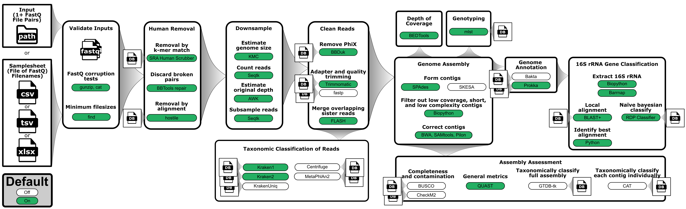

<h1>
  <picture>
    <source media="(prefers-color-scheme: dark)" srcset="images/wf-paired-end-illumina-assembly_logo_dark.png">
    
  </picture>
</h1>



> _General schematic of the steps in the workflow_

## Requirements

- [`Nextflow`](https://www.nextflow.io/docs/latest/getstarted.html#installation) (`>=22.04.3`)
- [`Docker`](https://docs.docker.com/engine/installation/) or [`Singularity`](https://www.sylabs.io/guides/3.0/user-guide/) (`>=3.8.0`)

## Install workflow locally

```bash
git clone https://github.com/bacterial-genomics/wf-paired-end-illumina-assembly.git
```

# Run workflow

Before running workflow on new data, the workflow should be run on the built-in test data to make sure everything is working properly. It will also download all dependencies to make subsequent runs much faster.

```bash
cd wf-paired-end-illumina-assembly/

nextflow run main.nf -profile singularity,test --outdir results
```

## Usage

```bash
nextflow run main.nf \
  -profile singularity \
  --input INPUT_DIRECTORY \
  --outdir OUTPUT_DIRECTORY \
  --assembler <spades|skesa>
```

When running locally, `--max_cpus` and `--max_memory` may need to be specified. Below, max CPUs is set to 4 and max memory is set to 16 (for 16GB).

```bash
nextflow run main.nf \
  -profile singularity \
  --input INPUT_DIRECTORY \
  --outdir OUTPUT_DIRECTORY \
  --max_cpus 4 \
  --max_memory 16
```

### Help menu of all options

```bash
nextflow run main.nf --help
```

Test data was generated by taking top 1 million lines (=250k reads) of SRA data SRR16343585. (Note: This requires SRA Toolkit)

```bash
fasterq-dump SRR16343585
head -1000000 SRR16343585_1.fastq > test_R1.fastq
head -1000000 SRR16343585_2.fastq > test_R2.fastq
pigz test_R{1,2}.fastq
```
